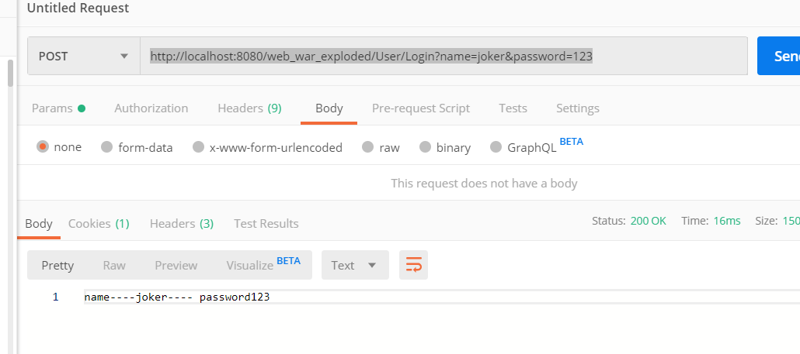
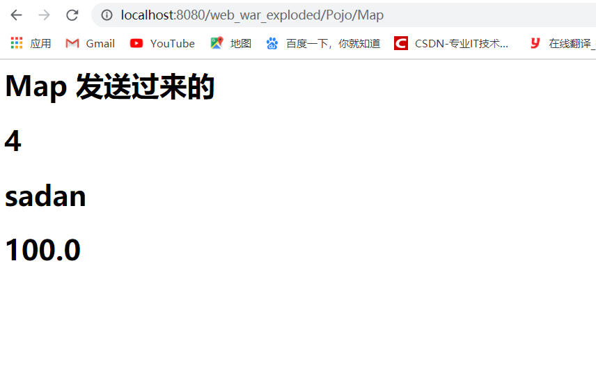
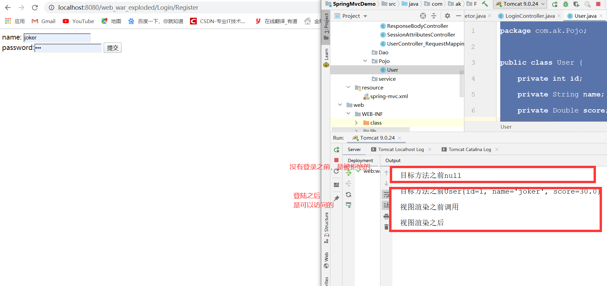

# 1. SpringMVC 介绍

## 1.1 什么是SpringMVC

简单的讲  Spring MVC是一个基于MVC架构的用来简化web应用程序开发的应用开发框架，它是Spring的一部分，它和Struts2一样都属于表现层的框架。

处理流程：视图将请求发送给控制器，由控制器选择对应的模型来处理；模型将处理结果交给控制器，控制器选择合适的视图来展现处理结果；

## 1.2 SpringMVC 有哪些内容

Spring  的五大组件

前端控制器 （DispatcherServlet）
映射处理器（HandlerMapping）
处理器（Controller）
模型和视图（ModelAndView）
视图解析器（ViewResolver）


## 1.3 SpringMVC 的控制器是不是单例模式

springmvc controller默认的是单例singleton的，具体可以查看注解scope可以一目了然。

单例的原因有二：

1、为了性能。(不用每次请求都创建对象)

2、不需要多例。(不要在控制器中定义成员变量)

## 1.4 SpringMVC  的 优点


* 1.清晰的角色划分：控制器(controller)、验证器(validator)、命令对象(command obect)、表单对象(form object)、模型对象(model object)、Servlet分发器(DispatcherServlet)、处理器映射(handler mapping)、试图解析器(view resoler)等等。每一个角色都可以由一个专门的对象来实现。

* 2.强大而直接的配置方式：将框架类和应用程序类都能作为JavaBean配置，支持跨多个context的引用，例如，在web控制器中对业务对象和验证器validator)的引用。

* 3.可适配、非侵入：可以根据不同的应用场景，选择何事的控制器子类(simple型、command型、from型、wizard型、multi-action型或者自定义)，而不是一个单一控制器(比如Action/ActionForm)继承。

* 4.可重用的业务代码：可以使用现有的业务对象作为命令或表单对象，而不需要去扩展某个特定框架的基类。

* .可定制的绑定(binding)和验证(validation)：比如将类型不匹配作为应用级的验证错误，这可以保证错误的值。再比如本地化的日期和数字绑定等等。在其他某些框架中，你只能使用字符串表单对象，需要手动解析它并转换到业务对象。

* 6.可定制的handler mapping和view resolution：Spring提供从最简单的URL映射，到复杂的、专用的定制策略。与某些web MVC框架强制开发人员使用单一特定技术相比，Spring显得更加灵活。

* 7.灵活的model转换：在Springweb框架中，使用基于Map的键/值对来达到轻易的与各种视图技术集成。

* 8.可定制的本地化和主题(theme)解析：支持在JSP中可选择地使用Spring标签库、支持JSTL、支持Velocity(不需要额外的中间层)等等。

* 9.简单而强大的JSP标签库(Spring Tag Library)：支持包括诸如数据绑定和主题(theme)之类的许多功能。他提供在标记方面的最大灵活性。

* 10.JSP表单标签库：在Spring2.0中引入的表单标签库，使用在JSP编写表单更加容易。

* 11.Spring Bean的生命周期：可以被限制在当前的HTTp Request或者HTTp Session。准确的说，这并非Spring MVC框架本身特性，而应归属于Spring MVC使用的WebApplicationContext容器。

# 2. Sping MVC的 运行原理

## 2.1 组件解释

* 1、前端控制器DispatcherServlet（不需要工程师开发）,由框架提供
作用：接收请求，响应结果，相当于转发器，中央处理器。有了dispatcherServlet减少了其它组件之间的耦合度。
用户请求到达前端控制器，它就相当于mvc模式中的c，dispatcherServlet是整个流程控制的中心，由它调用其它组件处理用户的请求，dispatcherServlet的存在降低了组件之间的耦合性。

* 2、处理器映射器HandlerMapping(不需要工程师开发),由框架提供
作用：根据请求的url查找Handler
HandlerMapping负责根据用户请求找到Handler即处理器，springmvc提供了不同的映射器实现不同的映射方式，例如：配置文件方式，实现接口方式，注解方式等。

* 3、处理器适配器HandlerAdapter
作用：按照特定规则（HandlerAdapter要求的规则）去执行Handler
通过HandlerAdapter对处理器进行执行，这是适配器模式的应用，通过扩展适配器可以对更多类型的处理器进行执行。

* 4、处理器Handler(需要工程师开发)
注意：编写Handler时按照HandlerAdapter的要求去做，这样适配器才可以去正确执行Handler
Handler 是继DispatcherServlet前端控制器的后端控制器，在DispatcherServlet的控制下Handler对具体的用户请求进行处理。
由于Handler涉及到具体的用户业务请求，所以一般情况需要工程师根据业务需求开发Handler。

* 5、视图解析器View resolver(不需要工程师开发),由框架提供
作用：进行视图解析，根据逻辑视图名解析成真正的视图（view）
View Resolver负责将处理结果生成View视图，View Resolver首先根据逻辑视图名解析成物理视图名即具体的页面地址，再生成View视图对象，最后对View进行渲染将处理结果通过页面展示给用户。 springmvc框架提供了很多的View视图类型，包括：jstlView、freemarkerView、pdfView等。
一般情况下需要通过页面标签或页面模版技术将模型数据通过页面展示给用户，需要由工程师根据业务需求开发具体的页面。

* 6、视图View(需要工程师开发jsp...)
View是一个接口，实现类支持不同的View类型（jsp、freemarker、pdf...）


## 2.2 图片解释


## 2.3 文字解释

DispatcherServlet 由DispatcherServlet控制器查询一个或多个HandlerMapping，找到处理请求的Controller DispatcherServlet将请求提交到Controller Controller调用业务逻辑处理后，返回ModelAndView DispatcherServlet查询一个或多个ViewResoler视图解析器，找到ModelAndView指定的视图 视图负责将结果显示到客户

## 2.4 流程介绍

### 2.4.1 流程介绍

* 1、首先用户发送请求——>DispatcherServlet，前端控制器收到请求后自己不进行处理，而是委托给其他的解析器进行处理，作为统一访问点，进行全局的流程控制；
* 2、DispatcherServlet——>HandlerMapping， HandlerMapping 将会把请求映射为HandlerExecutionChain 对象（包含一个Handler 处理器（页面控制器）对象、多个HandlerInterceptor 拦截器）对象，通过这种策略模式，很容易添加新的映射策略；
* 3、DispatcherServlet——>HandlerAdapter，HandlerAdapter 将会把处理器包装为适配器，从而支持多种类型的处理器，即适配器设计模式的应用，从而很容易支持很多类型的处理器；
* 4、HandlerAdapter——>处理器功能处理方法的调用，HandlerAdapter 将会根据适配的结果调用真正的处理器的功能处理方法，完成功能处理；并返回一个ModelAndView 对象（包含模型数据、逻辑视图名）；
* 5、ModelAndView的逻辑视图名——> ViewResolver， ViewResolver 将把逻辑视图名解析为具体的View，通过这种策略模式，很容易更换其他视图技术；
* 6、View——>渲染，View会根据传进来的Model模型数据进行渲染，此处的Model实际是一个Map数据结构，因此很容易支持其他视图技术；
* 7、返回控制权给DispatcherServlet，由DispatcherServlet返回响应给用户，到此一个流程结束。

### 2.4.2 流程介绍

* 1、 用户发送请求至前端控制器DispatcherServlet。

* 2、 DispatcherServlet收到请求调用HandlerMapping处理器映射器。

* 3、 处理器映射器找到具体的处理器(可以根据xml配置、注解进行查找)，生成处理器对象及处理器拦截器(如果有则生成)一并返回给DispatcherServlet。

* 4、 DispatcherServlet调用HandlerAdapter处理器适配器。

* 5、 HandlerAdapter经过适配调用具体的处理器(Controller，也叫后端控制器)。

* 6、 Controller执行完成返回ModelAndView。

* 7、 HandlerAdapter将controller执行结果ModelAndView返回给DispatcherServlet。

* 8、 DispatcherServlet将ModelAndView传给ViewReslover视图解析器。

* 9、 ViewReslover解析后返回具体View。

* 10、DispatcherServlet根据View进行渲染视图（即将模型数据填充至视图中）。

* 11、 DispatcherServlet响应用户。

# 3. SpringMVC  入门

## 3.1 案例入门

### 3.1.1 创建新的工程


### 3.1.2 在 WEB-INF 下面创建 classes 和 lib 文件夹 


### 3.1.3 然后把jar 包放入其中

* 点击File -> Project Setting ,点击Modules -> Paths ，把 outpath  全部变成class

  

* 点击 dependencies 添加依赖

  

  

  

* 前期准备就都准备完毕，然后创建 src 下面创建 java,resource,Test 三个目录(如果创建不了，右键点击Mark Directory as)

  java  天蓝色 表示的是 放package 的地方

  resource 灰色 表示资源地方，一般放置html,css 的地方

  Test 绿色 表示进行测试的地方

  **一定要进行mark directory as **

### 3.1.4 修改web.xml 内容

  ~~~xml
<?xml version="1.0" encoding="UTF-8"?>
<web-app xmlns="http://java.sun.com/xml/ns/javaee"
           xmlns:xsi="http://www.w3.org/2001/XMLSchema-instance"
           xsi:schemaLocation="http://java.sun.com/xml/ns/javaee
		  http://java.sun.com/xml/ns/javaee/web-app_4_0.xsd"
           version="3.0">


    <!-- The front controller of this Spring Web application, responsible for handling all application requests -->
    <servlet>
        <servlet-name>springDispatcherServlet</servlet-name>
        <servlet-class>org.springframework.web.servlet.DispatcherServlet</servlet-class>
        <init-param>
            <param-name>contextConfigLocation</param-name>
            <param-value>classpath:spring-mvc.xml</param-value> 
            <!-- 需要修改，指定加载的配置文件路径-->
        </init-param>
        <!-- 		启动容器时加载这个sevlet ,值是整数，表示启动容器时加载的顺序
                大于或等于0 表示容器在启动时就加载并初始化，数字越小，优先级越高
                小于0或未指定,表示容器在该servlet被请求时，才会被加载
                值相等时，容器自己选择优先加载
        -->
        <load-on-startup>1</load-on-startup>
    </servlet>
    
    <!-- Map all requests to the DispatcherServlet for handling -->
    <servlet-mapping>
        <servlet-name>springDispatcherServlet</servlet-name>
        <url-pattern>/</url-pattern> <!-- 需要修改，指定访问路径-->
    </servlet-mapping>
    
    <welcome-file-list>
        <welcome-file>index.jsp</welcome-file>
    </welcome-file-list>

</web-app>

  ~~~

### 3.1.5 创建 spring-mvc.xml

~~~xml
<?xml version="1.0" encoding="UTF-8"?>
<beans xmlns="http://www.springframework.org/schema/beans"
       xmlns:xsi="http://www.w3.org/2001/XMLSchema-instance"
       xmlns:context="http://www.springframework.org/schema/context"
       xsi:schemaLocation="http://www.springframework.org/schema/beans http://www.springframework.org/schema/beans/spring-beans.xsd
		http://www.springframework.org/schema/context http://www.springframework.org/schema/context/spring-context-4.3.xsd">

    <!-- 配置扫描包路径 -->
    <context:component-scan base-package="com.ak"></context:component-scan>

    <!-- 	配置视图解析器 -->
    <bean class="org.springframework.web.servlet.view.InternalResourceViewResolver">
        <property name="prefix" value="/WEB-INF/views/"></property>
        <property name="suffix" value=".jsp"></property>
    </bean>

</beans>
~~~

### 3.1.6 创建 HelloController

~~~java
package com.ak.controller;

import org.springframework.stereotype.Controller;
import org.springframework.web.bind.annotation.RequestBody;
import org.springframework.web.bind.annotation.RequestMapping;
import org.springframework.web.bind.annotation.ResponseBody;

@Controller
public class HelloController {

    /**
     * RequestMapping注解：
     * 将Web请求映射到特定处理程序类和/或处理程序方法，
     * 	这个注解可以用于类或者方法上，并通过属性value指定请求路径
     *
     * 返回值会通过视图解析器解析为实际的视图，对于InternalResourceViewResolver视图解析器，
     * 最后会通过 prefix + returnVal + suffix 的方式得到实际的视图
     *
     * @return
     */
    @RequestMapping("/hello")
    public String kk(){
        return "hello";
    }

    @RequestMapping("/data")
    @ResponseBody
    public String k1(){
        return "return data --->>>1>>2";
    }
}

~~~


### 3.1.7 结果展示 
~~~
http://localhost:8080/项目名/hello 
~~~

---返回页面


用PostMan 测试结果


http://localhost:8080/项目名/data  ---返回数据


## 3.2 注解讲解

**返回值类型 为 String 的话 ，返回的是 页面 ，如果想返回 String  d的数据  必须加上 @@ResponseBody**

简单的讲

返回页面，只有下面的方法。其他都是返回数据

* 返回值类型String ，注解不能有 @ResponseBody
* modelandview 需要视图解析器 能指定跳转页面
* 使用HttpServletRequest 转发（默认访问/下的index.jsp页面 不受渲染器的影响）
* 使用HttpServletResponse 重定向到另一个视图(其他不变 )
* 通过HttpServletResponse的API直接输出（不需要配置渲染器）


### 3.2.1  @RequestMapping

介绍

* 将Web请求 映射到 特定处理程序类和/或处理程序方法，

* 这个注解可以用于类或者方法上，并通过属性value指定请求路径


**全部代码**

~~~java
package com.ak.controller;


import org.springframework.http.MediaType;
import org.springframework.stereotype.Controller;
import org.springframework.web.bind.annotation.GetMapping;
import org.springframework.web.bind.annotation.RequestMapping;
import org.springframework.web.bind.annotation.RequestMethod;
import org.springframework.web.bind.annotation.ResponseBody;

/**
 * 测试 @RequestMapping 注解
 */
@Controller
@RequestMapping("User")
public class UserController_RequestMapping {

    /**
     * http://localhost:8080/项目名/User/Add
     * Value 的  单路径
     * @return
     */
    @RequestMapping(value = "/Add")
    @ResponseBody
    public String Add(){
        return "add user Sucess";
    }

    /**
     * Value  的多路径
     * @return
     */
    @RequestMapping(value = {"/hello","helloworld"})
    @ResponseBody
    public String Add1(){
        return "dd user Sucess  Value_More";
    }

    /**
     * http://localhost:8080/项目名/User/Login?name=joker&password=123
     * path 属性讲解
     * @param name
     * @param password
     * @return
     */
    @ResponseBody
    @RequestMapping(path = "/Login" )
    public String Login(String name,String password){
        return "name----"+name+"---- password"+password;
    }


    /**
     * Method  的单个请求
     * @param name
     * @param password
     * @return
     */
    @ResponseBody
    @RequestMapping(value = "/Method_Get",method = RequestMethod.GET)
    public String Login1(String name,String password){
        return "name----"+name+"---- password"+password;
    }

    /**
     * Method 的多个请求
     * @param name
     * @param password
     * @return
     */
    @ResponseBody
    @RequestMapping(value = "/Method_More",method = {RequestMethod.GET,RequestMethod.POST})
    public String Login2(String name,String password){
        return "name----"+name+"---- password"+password;
    }

    /**
     * param 用法  param!=
     * @return
     */
    @RequestMapping(value = "/Update_NotEqual",params = "name!=joker")
    @ResponseBody
    public String Update(){
        return "param!=";
    }

    /**
     * param 用法  param=
     * @return
     */
    @RequestMapping(value = "/Update_Equal",params = "name=joker")
    @ResponseBody
    public String Update1(){
        return "param==";
    }

    /**
     * param 用法  !param
     * @return
     */
    @RequestMapping(value = "/Update_NotHave",params = "!name")
    @ResponseBody
    public String Update2(){
        return "!param";
    }

    /**
     * param 用法  !param
     * @return
     */
    @RequestMapping(value = "/Update_Have",params = "name")
    @ResponseBody
    public String Update5(String name){
        return "param"+name;
    }

    /**
     * Headers 用法
     * @return
     */
    @RequestMapping(value = "/Delete",headers = "Accept-Language=en,zh-CN;q=0.9,zh;q=0.8")
    @ResponseBody
    public String Update3(){
        return "添加用户成功";
    }

    /**
     *  Consumes 用法
     * @return
     */
//    @RequestMapping(value="/hw" ,consumes= MediaType.TEXT_HTML_VALUE)
	@RequestMapping(value="/hw" ,consumes="text/html") //也可以直接写类型
    public String helloWorld2() {
        return "hello";
    }

    @RequestMapping("/he/*/hw3")
    public String helloWorld3() {
        return "hello";
    }

    @RequestMapping("/h/**/hw3")
    public String helloWorld4() {
        return "hello";
    }

    @RequestMapping("/hw/hw???")//注意：三个问号，要传入3个字符，否则匹配失败
    public String helloWorld5() {
        return "hello";
    }

    /**
     * 等价于     @RequestMapping(value = "getMapping",method = RequestMethod.GET)
     *
     * @return
     */
    @GetMapping("/getMapping")
    public String helloWorld6() {
        return "hello";
    }
}

~~~


#### (1) 用在方法上

**提供初步的请求映射信息 表示的是根目录**

比如，处理 用户的一般用User,然后细分

**实例**

**http://localhost:8080/springmvc01/<font color='red'>hw</font>/ helloWorld**

 ~~~java
@Controller

@RequestMapping("/hw")

public class HelloWorldController {

 	@RequestMapping(value = "/helloWorld")

public String helloWorld() {
		return "success";
	}
}
 ~~~

#### (2) 用在属性上

提供进一步的细分映射信息，相对于类定义出的URL。如果类定义处没有标注@RequestMapping,则方法处标记的URL相对于项目的根目录

http://localhost:8080/springmvc01/helloWorld

~~~java
@Controller
public class HelloWorldController {

	@RequestMapping(value = "/helloWorld")
	public String helloWorld() {
		return "success";
	}
	
}
~~~

#### (3)属性讲解

<font color='red'>下面测试我在类上面家里@RequestMapping("User")</font>

 所以在路径上面有User

##### Value

用于指定映射路径，同path。可以指定多个路径

* 单个路径

  http://localhost:8080/项目名/User/Add

  ~~~java
   /**
       * Value 的  单路径
       * @return
       */
      @RequestMapping(value = "/Add")
      @ResponseBody
      public String Add(){
          return "add user Sucess";
      }
  ~~~

  

* 多个路径

  访问http://localhost:8080/项目名/User/hello

  ​	或 http://localhost:8080/项目名/User/helloworld

  ~~~java
  /**
       * Value  的多路径
       * @return
       */
      @RequestMapping(value = {"/hello","helloworld"})
      @ResponseBody
      public String Add1(){
          return "dd user Sucess  Value_More";
      }
  ~~~


##### Path

用于指定映射路径，同value。

~~~
http://localhost:8080/项目名/User/Login?name=joker&password=123
~~~


~~~java
   /**
     * path 属性讲解
     * @param name
     * @param password
     * @return
     */
    @ResponseBody
    @RequestMapping(path = "/Login" )
    public String Login(String name,String password){
        return "name----"+name+"---- password"+password;
    }

~~~



##### Method

用于指定请求类型：GET, POST, HEAD, OPTIONS, PUT, PATCH, DELETE, TRACE .可以不写，默认为get/post.

* 单个请求

  ~~~
  http://localhost:8080/项目名/User/Method_Get?name=joker&password=123
  ~~~

  ~~~java
   /**
       * Method  的单个请求
       * @param name
       * @param password
       * @return
       */
      @ResponseBody
      @RequestMapping(value = "/Method_Get",method = RequestMethod.GET)
      public String Login1(String name,String password){
          return "name----"+name+"---- password"+password;
      }
  ~~~

  

* 多个请求

  ~~~
  http://localhost:8080/项目名/User/Method_More?name=joker&password=123
  ~~~

  ~~~java
  /**
       * Method 的多个请求
       * @param name
       * @param password
       * @return
       */
      @ResponseBody
      @RequestMapping(value = "/Method_More",method = {RequestMethod.GET,RequestMethod.POST})
      public String Login2(String name,String password){
          return "name----"+name+"---- password"+password;
      }
  ~~~

  


##### Params

指定请求的参数。支持简单的表达式,例如：

* param:表示请求必须包含名为param的请求参数

  ~~~java
  /**
       * param 用法  !param
       * @return
       */
      @RequestMapping(value = "/Update_Have",params = "name")
      @ResponseBody
      public String Update5(String name){
          return "param"+name;
      }
  ~~~

  ~~~
  http://localhost:8080/项目名/User/Update_Have?kk=1 --不行
  ~~~

  ~~~
  http://localhost:8080/项目名/User/Update_Have?name=joker --行
  ~~~

  

  

* !param:表示请求不能包含名为param的请求参数

  ~~~java
   /**
       * param 用法  !param
       * @return
       */
      @RequestMapping(value = "/Update_NotHave",params = "!name")
      @ResponseBody
      public String Update2(){
          return "!param";
      }
  ~~~

  

  ~~~
  http://localhost:8080/项目名/User/Update_NotHave?name=joker  --不行
  ~~~

  ~~~
  http://localhost:8080/项目名/User/Update_NotHave?kk=1  --行
  ~~~

  

  

* param!= value1:表示请求包含名为param的请求参数，但其值不能为value1

  ~~~
  http://localhost:8080/项目名/User/Update_NotEqual?name=joker ---不行
  http://localhost:8080/项目名/User/Update_NotEqual?name=peter -- 可以
  ~~~

  ~~~
  /**
       * param 用法  param
       * @return
       */
      @RequestMapping(value = "/Update_NotEqual",params = "name!=joker")
      @ResponseBody
      public String Update(){
          return "param!=";
      }
  ~~~

  

  

* {“param1=value1”,”param2”}:请求必须包含名为param1和param2的两个请求参数，且param1参数的值必须为value1

  ~~~java
      /**
       * param 用法  param
       * @return
       */
      @RequestMapping(value = "/Update_Equal",params = "name=joker")
      @ResponseBody
      public String Update1(){
          return "param==";
      }
  ~~~

  ~~~
  http://localhost:8080/项目名/User/Update_Equal?name=peter --不行
  http://localhost:8080/项目名/User/Update_Equal?name=joker --行
  ~~~


##### Headers

指定请求头部

~~~java
 /**
     * Headers 用法
     * @return
     */
    @RequestMapping(value = "/Delete",headers = "Accept-Language=en,zh-CN;q=0.9,zh;q=0.8")
    @ResponseBody
    public String Update3(){
        return "添加用户成功";
    }
~~~


##### Consumers

指定处理请求提交的内容类型（Content-Type），例如application/json, text/html，只有在Content-Type匹配这些媒体类型之一时才会映射请求。

它支持否定表达式，如：!text/plain表示除了text/plain以外的其他内容类型。

可使用在方法上，也可以使用在类上。当在方法上和类上都使用时，方法级别的使用会覆盖类上的使用。

~~~java
/**
     *  Consumes 用法
     * @return
     */
//    @RequestMapping(value="/hw" ,consumes= MediaType.TEXT_HTML_VALUE)
	@RequestMapping(value="/hw" ,consumes="text/html") //也可以直接写类型
    public String helloWorld2() {
        return "hello";
    }
~~~


http://localhost:8080/项目名/User/hw 


#### (4)映射请求--通配符

* ? : 匹配文件名中的一个字符

* \*: 匹配文件名中的任意字符

* ** : 匹配多层路径

/user/*/add: 匹配/user/aaa/add   /user/bbb/add等

 /user/**/add 匹配/user/add   /user/aaa/bbb/add等

/user/add??  匹配/user/addUseraa  /user/addUserbb等

**案例**

路径:

http://localhost:8080/项目名/User/he/sada/hw3

http://localhost:8080/项目名/User/he/asdda/hw3

~~~java
  @RequestMapping("/he/*/hw3")
    public String helloWorld3() {
        return "hello";
    }
~~~


路径:

http://localhost:8080/项目名/User/h/a/b/c/hw3

http://localhost:8080/项目名/User/h/aaaaa/b/c/hw3

~~~java
  @RequestMapping("/h/**/hw3")
    public String helloWorld4() {
        return "hello";
    }
~~~


路径:

http://localhost:8080/项目名/User/hw/hwasa

http://localhost:8080/项目名/User/hw/hwaAA

http://localhost:8080/项目名/User/hw/hwaAAB --不行

~~~java
   @RequestMapping("/hw/hw???")//注意：三个问号，要传入3个字符，否则匹配失败
    public String helloWorld5() {
        return "hello";
    }
~~~


#### (5)快捷方式变体

在类级别，需要使用@RequestMapping.

以下几种mapping，使用在方法上。

##### @GetMapping

 x相当于 @RequestMapping(method = RequestMethod.GET)


~~~java
 /**
     * 等价于     @RequestMapping(value = "getMapping",method = RequestMethod.GET)
     *
     * @return
     */
    @GetMapping("/getMapping")
    public String helloWorld6() {
        return "hello";
    }
~~~

http://localhost:8080/项目名/User/getMapping


##### @PostMapping

#####  @PutMapping

##### @DeleteMapping

##### @PatchMapping


### 3.2.2 @Pathvariable

映射URL绑定的占位符。

通过@PathVariable可以将URL中占位符参数{XXX}绑定到控制器处理方法的入参中

**全部代码**

~~~java
package com.ak.controller;

import org.springframework.stereotype.Controller;
import org.springframework.web.bind.annotation.GetMapping;
import org.springframework.web.bind.annotation.PathVariable;
import org.springframework.web.bind.annotation.RequestMapping;

/**
 * Pathvariable 讲解
 * 取走的是 URL 上面的内容，不是 URL 后面？ 的内容
 */
@RequestMapping("Pathvariable")
@Controller
public class PathvariableController {

    /**
     * 单参数
     * @param user_name
     * @return
     */
    @GetMapping("/sayhello/{name}")
    public String k1(@PathVariable("name") String user_name){
       System.out.println("name -->>"+user_name);
        return "success";
    }

    /**
     * 多参数
     * @param name
     * @param content
     * @return
     */
    @GetMapping("/{name}/say/{content}")
    public String saySth(@PathVariable String name,@PathVariable String content) {
        System.out.println(name+",say: " + content);
        return "success";
    }

    /**
     * 正则表达式 ,匹配的是 一个小写字母+一个数字
     * 其他 比如 joker1--不行 Per1 不行
     * j1,p3,h3 啥的都可以
     * @param name
     * @param content
     * @return
     */
    @GetMapping("/{name:[a-z]\\d}/says/{content}")
    public String saySth2(@PathVariable("name") String name,@PathVariable("content") String content) {
        System.out.println(name+",say: " + content);
        return "success";
    }

    /**
     * 正则表达式的
     * URL:/spring-web-3.0.5.jar
     * @param version
     * @param ext
     */
    @GetMapping("/{name:[a-z-]+}-{version:\\d\\.\\d\\.\\d}{ext:\\.[a-z]+}")
    public String handle(@PathVariable String version, @PathVariable String ext) {
       System.out.println(version+"-----ext--"+ext);
       return "success";
    }

}

~~~


#### (1) 单参数

http://localhost:8080/项目名/Pathvariable/sayhello/joker

~~~java
 /**
     * 单参数
     * @param user_name
     * @return
     */
    @GetMapping("/sayhello/{name}")
    public String k1(@PathVariable("name") String user_name){
       System.out.println("name -->>"+user_name);
        return "success";
    }
~~~


#### (2) 多参数

http://localhost:8080/项目名/Pathvariable/joker/say/nihao

~~~java
 /**
     * 多参数
     * @param name
     * @param content
     * @return
     */
    @GetMapping("/{name}/say/{content}")
    public String saySth(@PathVariable String name,@PathVariable String content) {
        System.out.println(name+",say: " + content);
        return "success";
    }

~~~


#### (3) 正则表达式

{varName:regex}

varName：变量名

regex ： 正则表达式

http://localhost:8080/项目名/Pathvariable/j1/says/nihao

~~~java
/**
     * 正则表达式 ,匹配的是 一个小写字母+一个数字
     * 其他 比如 joker1--不行 Per1 不行
     * j1,p3,h3 啥的都可以
     * @param name
     * @param content
     * @return
     */
    @GetMapping("/{name:[a-z]\\d}/says/{content}")
    public String saySth2(@PathVariable("name") String name,@PathVariable("content") String content) {
        System.out.println(name+",say: " + content);
        return "success";
    }

~~~


http://localhost:8080/项目名/Pathvariable/spring-web-3.0.5.jar

~~~
 /**
     * 正则表达式的
     * URL:/spring-web-3.0.5.jar
     * @param version
     * @param ext
     */
    @GetMapping("/{name:[a-z-]+}-{version:\\d\\.\\d\\.\\d}{ext:\\.[a-z]+}")
    public String handle(@PathVariable String version, @PathVariable String ext) {
       System.out.println(version+"-----ext--"+ext);
       return "success";
    }
~~~


### 3.2.3 @RequestParam 注解

解析的是 URL 后面 ？的参数

把请求参数传递给方法。包含三个属性：

* value: 参数名

* defaultValue: 默认值，如果设置了defaultValue的值，则会隐式的将required设置为false

* required: 是否必须，布尔型。默认为true，表示请求参数中必须包含对应的参数。

http://localhost:8080/项目名/RequestParam/sayHello?name=joker

**代码**

~~~java
package com.ak.controller;


import org.springframework.stereotype.Controller;
import org.springframework.web.bind.annotation.GetMapping;
import org.springframework.web.bind.annotation.RequestMapping;
import org.springframework.web.bind.annotation.RequestParam;

@Controller
@RequestMapping("/RequestParam")
public class RequestParamController {

    /**
     *
     * @param name 姓名
     * @param age 年龄，非必传，默认为10
     * @return
     */
    @GetMapping("/sayHello")
    public String sayHello(@RequestParam("name") String name,
                           @RequestParam(value="age",required=false,defaultValue="10") int age) {
        System.out.println(name+",age: " + age);
        return "success";
    }
}

~~~


### 3.2.4 @RequestHeader

Header 里面到底有啥

| Accept           | */*                   |
| ---------------- | --------------------- |
| Host             | localhost:8080        |
| Accept-Encoding  | gzip, deflate, br     |
| User-Agent       | PostmanRuntime/7.22.0 |
| Connection       | keep-alive            |
| Content-Language | zh-CN,en              |

~~~java
package com.ak.controller;

import org.springframework.stereotype.Controller;
import org.springframework.web.bind.annotation.GetMapping;
import org.springframework.web.bind.annotation.RequestHeader;
import org.springframework.web.bind.annotation.RequestMapping;
import org.springframework.web.bind.annotation.RequestParam;

import java.util.Map;

@Controller
@RequestMapping("RequestHeader")
public class RequestHeaderController {
    @GetMapping("/sayHello")
    public String sayHello(@RequestHeader("Host") String header) {
        System.out.println(header);
        return "success";
    }


    @GetMapping("/demo")
    public String handle(
            @RequestHeader("Accept-Encoding") String encoding,
            @RequestHeader("Keep-Alive") long keepAlive) {
        System.out.println(encoding+"---"+keepAlive);
    return "success";
    }

    /**
     * Map 获取
     * @param map
     * @return
     */
    @GetMapping("/sayHello_Map")
    public String sayHello(@RequestHeader Map<String,String> map) {
        for(String key:map.keySet()) {
            System.out.println("header: "+key +" , value : "+ map.get(key));
        }
        return "success";
    }

    /**
     * 数组可以获取
     * @param str
     * @return
     */
    @GetMapping("/sayHello_S")
    public String sayHello(@RequestHeader("accept-encoding") String[] str) {
        for(String s:str) {
            System.out.println(s);
        }
        System.out.println(str);
        return "success";
    }
}

~~~


http://localhost:8080/项目名/RequestHeader/sayHello_S


### 3.2.5 @CookieValue

获取Cookie 里面的内容

~~~java
package com.ak.controller;

import org.springframework.stereotype.Controller;
import org.springframework.web.bind.annotation.CookieValue;
import org.springframework.web.bind.annotation.GetMapping;
import org.springframework.web.bind.annotation.RequestMapping;

@RequestMapping("/Other")
@Controller
public class OtherController {

    /**
     *获取cookie中的JSESSIONID的值
     * @param value
     * @return
     */
    @GetMapping("/sayHello")
    public String sayHello(@CookieValue("JSESSIONID") String value) {
        System.out.println("value"+value);
        return "success";
    }

}

~~~

~~~java
http://localhost:8080/项目名/Other/sayHello
~~~


### 3.2.6 @SessionAttributes

用于在session中存放数据。只可以标注于类上。

 

共有三个属性：

* Value：字符串数组，写需要存储到session中数据的名称。例如：value={“name”,”age”,”phone”}

* Name:同value。

* Type: 根据指定参数的类型，将模型中对应类型的参数存储到session中。例如：types= {String.class,Integer.class}, model或map或modelmap中绑定的参数如果有String或Integer类型，将会被放入到session中。

~~~java
package com.ak.controller;

import org.springframework.stereotype.Controller;
import org.springframework.ui.Model;
import org.springframework.web.bind.annotation.GetMapping;
import org.springframework.web.bind.annotation.RequestMapping;
import org.springframework.web.bind.annotation.SessionAttribute;
import org.springframework.web.bind.annotation.SessionAttributes;
import org.springframework.web.bind.support.SessionStatus;

@SessionAttributes("name")
//也可以@SessionAttributes(types=String.class)
@Controller
@RequestMapping("/SessionAttributes")
public class SessionAttributesController {

    /**
     * 在Model 里面放置 ，可以放进session
     * @param model
     * @return
     */
    @GetMapping("/sayHello")
    public String sayHello(Model model) {
        model.addAttribute("name", "amy");
        return "success";
    }


    @RequestMapping(value="/hw")
    public String helloWorld(SessionStatus status) {
        status.setComplete();//这个方法会清空SessionAttributes里的所有数据
        return "success";
    }

    /**
     * 获取 session 里面的 内容
     * @param name
     * @return
     */
    @RequestMapping("/demo")
    public String method2(@SessionAttribute("name") String name) {
        System.out.println("name----"+name);
        return "success";
    }


}

~~~

首先输入,先存 session

~~~
http://localhost:8080/项目名/SessionAttributes/sayHello
~~~

然后,取session

~~~
http://localhost:8080/项目名/SessionAttributes/demo
~~~

**session 只能在同一台电脑上 一个浏览器上存在时间 几分钟到几十分钟，看自己设置。**


### 3.2.7 @SessionAttribute

获取存储在session中的数据，并作用在方法上。只能标注在参数上

同上


### 3.2.8 @ModelAttribute

实现 返回页面，并且把 数据 内容放入request 中，方便jsp 中取数据

返回页+返回数据，使用ModelAttribute


在方法上使用该注解：

SpringMVC在调用目标处理方法之前，会先逐个调用在方法上标注了@ModelAttribute的方法。

在方法的入参前使用@ModelAttribute 注解：

* 可以从隐含对象中获取隐含的模型数据中获取对象，再将请求参数绑定到对象中，再传入参数
* 将方法入参对象添加到模型中


**案例一：在方法上使用**

在方法上使用@ModelAttribute注解，如果方法有多个，会依次执行标注有该注解的方法。

创建实体类

~~~java
package com.ak.Pojo;

public class User {
    private int id;
    private String name;
    private Double score;

    public User(int id, String name, Double score) {
        this.id = id;
        this.name = name;
        this.score = score;
    }

    @Override
    public String toString() {
        return "User{" +
                "id=" + id +
                ", name='" + name + '\'' +
                ", score=" + score +
                '}';
    }

    public int getId() {
        return id;
    }

    public void setId(int id) {
        this.id = id;
    }

    public String getName() {
        return name;
    }

    public void setName(String name) {
        this.name = name;
    }

    public Double getScore() {
        return score;
    }

    public void setScore(Double score) {
        this.score = score;
    }
}

~~~


~~~java
package com.ak.controller;

import com.ak.Pojo.User;
import org.springframework.stereotype.Controller;
import org.springframework.ui.Model;
import org.springframework.web.bind.annotation.GetMapping;
import org.springframework.web.bind.annotation.ModelAttribute;
import org.springframework.web.bind.annotation.RequestMapping;

@RequestMapping("/ModelAttribute")
@Controller
public class ModelAttributeController {

    /**
     * 注解在 void 上
     */
    @ModelAttribute
    public void testModelAttribute1() {
        System.out.println("先执行这个方法1");
    }

    /**
     * 注解在 void
     * @param model
     */
    @ModelAttribute
    public void testModelAttribute(Model model) {
        System.out.println("先执行这个方法2");
        model.addAttribute("user1",new User(1,"ak",99.9));

    }
    /**
     * 这个返回值User，会被自动的放入Model中，绑定名为首字母小写user，相当于model.addAttribute("user", new User(2,"joker",50.0));
     * @return
     */
    @ModelAttribute
    public User testModelAttribute2() {
        System.out.println("先执行这个方法2");
        return new User(2,"joker",50.0);
    }

    /**
     * @ModelAttribute("userKelly") = @ModelAttribute(value="userKelly")
     * 显式的指定绑定名称。默认为User类名首字母小写
    注意：在目标方法中取值时，需要使用@ModelAttribute("userKelly")方式，否则取不到。
    例如
    public String  updateUser(@ModelAttribute("userKelly")User user){
    return SUCCESS;
    }
     * @return
     */
    @ModelAttribute("userKelly")
    public User testModelAttribute3() {
        System.out.println("先执行这个方法3");
        return new User(3,"peter",60.0);
    }

    @GetMapping("/sayHello")
    public String sayHello(Model model) {
       User user3=(User) model.getAttribute("userKelly");
       User user2=(User) model.getAttribute("user");
        User user1=(User) model.getAttribute("user1");
        System.out.println("执行了sayHello方法");
        System.out.println(user1);
        System.out.println(user2);
        System.out.println(user3);
        return "success";
    }
}

~~~

~~~
http://localhost:8080/项目名/ModelAttribute/sayHello
~~~


**案例二：和XXXMapping  放在一起使用**


创建login.jsp

~~~html
<%--
  Created by IntelliJ IDEA.
  User: bn
  Date: 2020/2/13
  Time: 19:41
  To change this template use File | Settings | File Templates.
--%>
<%@ page contentType="text/html;charset=UTF-8" language="java" %>
<html>
<head>
    <title>Title</title>
</head>
<body>
login  的 jsp
<% String name =(String)request.getAttribute("returnVal");%>
<%=name%>
</body>
</html>

~~~

~~~html
<%--
  Created by IntelliJ IDEA.
  User: bn
  Date: 2020/2/13
  Time: 19:41
  To change this template use File | Settings | File Templates.
--%>
<%@ page contentType="text/html;charset=UTF-8" language="java" %>
<html>
<head>
    <title>Title</title>
</head>
<body>
login1----  的 jsp
<% String name =(String)request.getAttribute("returnVal");%>
<%=name%>
</body>
</html>

~~~


~~~JAVA
package com.ak.controller;

import com.ak.Pojo.User;
import org.springframework.stereotype.Controller;
import org.springframework.ui.Model;
import org.springframework.web.bind.annotation.GetMapping;
import org.springframework.web.bind.annotation.ModelAttribute;
import org.springframework.web.bind.annotation.RequestMapping;
import org.springframework.web.bind.annotation.ResponseBody;

//@RequestMapping("/ModelAttribute")
@Controller
public class ModelAttributeController_2 {

    /**
     * 这两个注解一起使用，返回的return "success" 并不是返回视图的名称，而是把success放入了model中，
     * 返回的视图名称是@RequestMapping中的value值，即：testModelAttribute4
     * @return
     */
    @RequestMapping("login")//这个是值是返回的视图名称,意味这我需要login.jsp
    @ModelAttribute("returnVal")
    public String testModelAttribute4() {
        System.out.println("先执行这个方法4");
        return "success";//此处为放入model中绑定的值
        // 即model.addAttribute(“returnVal”,”success”)
    }

    /**
     * 实现的效果---和上面的一样
     * @return
     */
    @RequestMapping("login1")
    public  @ModelAttribute("returnVal")String testModelAttribute2() {
        System.out.println("先执行这个方法5");
        return "success";
    }

}

~~~


~~~
http://localhost:8080/项目名/login
~~~


**注意踩坑 --千万不要在类上面 写@RequestMapping 注解**

如何写了怎么办？？

~~~java
@RequestMapping("/ModelAttribute")
@Controller
public class ModelAttributeController_2{
     @RequestMapping("login")//这个是值是返回的视图名称,意味这我需要login.jsp
    @ModelAttribute("returnVal")
    public String testModelAttribute4() {
        return "data";
    }
}
~~~

那我们就 必须要有 prefix/ModelAttribute/login/suffix  文件

啥意思

必须要有 WEB-INF/views/ModelAttribute/login.jsp 这个文件，否则报错

项目结构


**案例三：放在入参 中**

~~~java
package com.ak.controller;

import com.ak.Pojo.User;
import org.springframework.stereotype.Controller;
import org.springframework.web.bind.annotation.GetMapping;
import org.springframework.web.bind.annotation.ModelAttribute;
import org.springframework.web.bind.annotation.RequestMapping;

@RequestMapping("/ModelAttribute")
@Controller
public class ModelAttributeController_3 {

    /**
     * 这个返回值User，会被自动的放入Model中，绑定名为首字母小写user，相当于model.addAttribute("user", new User("kelly2","30"));
     * @return
     */
    @ModelAttribute
    public User testModelAttribute2() {
        System.out.println("先执行这个方法2");
        return new User(1,"kelly2",30.0);
    }

    /**
     * 这个方法中的入参User user 的值，来自方法testModelAttribute2中。并且也会存在于model中。
     * @param user
     * @return
     */
    @GetMapping("/sayHello5")
    public String sayHello5(@ModelAttribute("user") User user) {
        System.out.println("执行了sayHello5方法");
        System.out.println(user);
        return "success";
    }
}

~~~

~~~
http://localhost:8080/项目名/ModelAttribute/sayHello5
~~~

~~~java
结果
先执行这个方法2
执行了sayHello5方法
User{id=1, name='kelly2', score=30.0}
~~~


### 3.2.9 @RequestAttribute

获取request中的值。

~~~java
package com.ak.controller;

import org.springframework.stereotype.Controller;
import org.springframework.web.bind.annotation.ModelAttribute;
import org.springframework.web.bind.annotation.RequestAttribute;
import org.springframework.web.bind.annotation.RequestMapping;

import javax.servlet.http.HttpServletRequest;

@Controller
@RequestMapping("/RequestAttribute")
public class RequestAttributeController {

    @ModelAttribute
    public void before(HttpServletRequest request) {
        request.setAttribute("na2", "shanghai");
        request.setAttribute("na1", "guangzhou");
    }

    @RequestMapping("/testme")
    public String testme(@RequestAttribute("na1") String na) { //这里的na1会取到上面方法中request的值
        System.out.println(na);
        return "success";
    }


}

~~~


~~~
http://localhost:8080/项目名/RequestAttribute/testme
~~~


### 3.2.10 @ResponseBody

如果需要处理 复杂类型的数据。需要添加jar 包和 xml

* 使用时需要加入以下三个jar包


* springmvc配置文件中加入**<mvc:annotation-driven />**。该注解启用后，Spring会默认帮我们注册处理请求，参数和返回值的类

~~~xml
<?xml version="1.0" encoding="UTF-8"?>
<beans xmlns="http://www.springframework.org/schema/beans"
       xmlns:xsi="http://www.w3.org/2001/XMLSchema-instance" xmlns:p="http://www.springframework.org/schema/p"
       xmlns:mvc="http://www.springframework.org/schema/mvc" xmlns:context="http://www.springframework.org/schema/context"
       xmlns:util="http://www.springframework.org/schema/util"
       xsi:schemaLocation="http://www.springframework.org/schema/beans http://www.springframework.org/schema/beans/spring-beans-4.3.xsd
            http://www.springframework.org/schema/context http://www.springframework.org/schema/context/spring-context-4.3.xsd
            http://www.springframework.org/schema/mvc http://www.springframework.org/schema/mvc/spring-mvc-4.3.xsd
            http://www.springframework.org/schema/util http://www.springframework.org/schema/util/spring-util-3.0.xsd">


    <!-- 配置扫描包路径 -->
    <context:component-scan base-package="com.ak"></context:component-scan>

    <!-- 	配置视图解析器 -->
    <bean class="org.springframework.web.servlet.view.InternalResourceViewResolver">
        <property name="prefix" value="/WEB-INF/views/"></property>
        <property name="suffix" value=".jsp"></property>
    </bean>

<!--     这个是 让 自动处理 Controller 层复杂的返回格式-->
    <mvc:annotation-driven />

</beans>
~~~


**上面的地址，已经更新成最新的 4.3版本，还有mvc 注解，需要添加 mvc  的约束文件，千万不要添加错误**

没有jar 包，会报错

~~~
org.springframework.http.converter.HttpMessageNotWritableException: No converter found for return value of type: class java.util.HashMap
~~~


找 jar 包 网址

~~~
https://maven.aliyun.com/mvn/search
~~~

~~~
https://mvnrepository.com/
~~~
**代码**

~~~java
package com.ak.controller;

import org.springframework.stereotype.Controller;
import org.springframework.web.bind.annotation.GetMapping;
import org.springframework.web.bind.annotation.RequestMapping;
import org.springframework.web.bind.annotation.ResponseBody;

import java.util.Date;
import java.util.HashMap;
import java.util.Map;

@RequestMapping("/ResponseBody")
@Controller
public class ResponseBodyController {


    @ResponseBody
    @GetMapping("/demo1")
    public Map<String,Object> demo1() {
        Map<String,Object> map = new HashMap<>();
        map.put("date", new Date());
        map.put("name", "罗小黑");
        map.put("age", 20);
        return map;
    }


}

~~~


#### 快捷变异体 @RestController

```
@Controller
@ResponseBody
```

## 3.3 处理方法 --类

### 3.3.1 实体类

SpringMVC 会按照请求名和POJO属性名进行自动匹配，自动为该对象填充属性值。支持级联属性

创建实体类 User

~~~java
package com.ak.Pojo;

public class User {
    private int id;
    private String name;
    private Double score;

    public User(int id, String name, Double score) {
        this.id = id;
        this.name = name;
        this.score = score;
    }

    @Override
    public String toString() {
        return "User{" +
                "id=" + id +
                ", name='" + name + '\'' +
                ", score=" + score +
                '}';
    }

    public int getId() {
        return id;
    }

    public void setId(int id) {
        this.id = id;
    }

    public String getName() {
        return name;
    }

    public void setName(String name) {
        this.name = name;
    }

    public Double getScore() {
        return score;
    }

    public void setScore(Double score) {
        this.score = score;
    }
}

~~~

user.jsp

~~~html
<form action="${pageContext.request.contextPath}/Pojo/User" method="post">
    id: <input type="number" name="id"><br>
    name: <input name="name" type="text"> <br>
    score: <input name="score" type="text"><br>
    <input type="submit" value="这个测试提交实体类信息，跳转页面">
</form>
~~~

controller 层的代码

~~~java
 @PostMapping("/User")
   public String kk(User u){
       System.out.println(u);
       return "success";
   }
~~~


### 3.3.2 使用Model

使用map作为传入参数，处理模型数据。

**代码实操**

users.jsp

~~~html
<form action="${pageContext.request.contextPath}/Pojo/Model" method="post">
    id: <input type="number" name="id"><br>
    name: <input name="name" type="text"> <br>
    score: <input name="score" type="text"><br>
    <input type="submit" value="这个测试提交给Model，跳转页面 ">
</form>
~~~

controller 层代码

~~~java
 @PostMapping("/Model")
    public String k1(User u, Model model){
        System.out.println(u);
        model.addAttribute("user",u);
        model.addAttribute("name","Model 发送过来的数据");
        return "accept";
    }
~~~

accept.jsp

~~~jsp
<%--
  Created by IntelliJ IDEA.
  User: bn
  Date: 2020/2/14
  Time: 9:10
  To change this template use File | Settings | File Templates.
--%>
<%@ page contentType="text/html;charset=UTF-8" language="java" %>
<html>
<head>
    <title>Title</title>
</head>
<body>

<h1>${name}</h1>
<h1>${user.id}</h1>
<h1>${user.name}</h1>
<h1>${user.score}</h1>

</body>
</html>

~~~


### 3.3.3 使用 ModelMap

同Model

**代码实操**

users.jsp

~~~html
<form action="${pageContext.request.contextPath}/Pojo/ModelMap" method="post">
    id: <input type="number" name="id"><br>
    name: <input name="name" type="text"> <br>
    score: <input name="score" type="text"><br>
    <input type="submit" value="这个测试提交给ModelMap,跳转页面 ">
</form>
~~~


Controller 层

~~~java
 @PostMapping("/ModelMap")
    public String k2(User u, ModelMap modelMap){
        System.out.println(u);
        modelMap.addAttribute("user",u);
        modelMap.addAttribute("name","Modelmap 发送过来的");
        return "accept";
    }
~~~

accept.jsp

~~~jsp
<%--
  Created by IntelliJ IDEA.
  User: bn
  Date: 2020/2/14
  Time: 9:10
  To change this template use File | Settings | File Templates.
--%>
<%@ page contentType="text/html;charset=UTF-8" language="java" %>
<html>
<head>
    <title>Title</title>
</head>
<body>

<h1>${name}</h1>
<h1>${user.id}</h1>
<h1>${user.name}</h1>
<h1>${user.score}</h1>

</body>
</html>

~~~


### 3.3.4 使用 Map

同上

**代码实操**

~~~html
<form action="${pageContext.request.contextPath}/Pojo/Map" method="post">
    id: <input type="number" name="id"><br>
    name: <input name="name" type="text"> <br>
    score: <input name="score" type="text"><br>
    <input type="submit" value="这个测试提交给Map,跳转页面 ">
</form>
~~~


Controller 层

~~~java
  @PostMapping("/Map")
    public String k5(User u, Map<String,Object> map){
        System.out.println(u);
        map.put("user",u);
        map.put("name","Map 发送过来的");
        return "accept";
    }
~~~

accept.jsp

~~~jsp
<%--
  Created by IntelliJ IDEA.
  User: bn
  Date: 2020/2/14
  Time: 9:10
  To change this template use File | Settings | File Templates.
--%>
<%@ page contentType="text/html;charset=UTF-8" language="java" %>
<html>
<head>
    <title>Title</title>
</head>
<body>

<h1>${name}</h1>
<h1>${user.id}</h1>
<h1>${user.name}</h1>
<h1>${user.score}</h1>

</body>
</html>

~~~





### 3.3.5 使用ModelAttribure

控制器处理方法的返回值如果为ModelAndView,则其既包含视图信息，也包含模型数据信息。


**代码实操**

users.jsp

~~~html
<form action="${pageContext.request.contextPath}/Pojo/ModelAndView" method="post">
    id: <input type="number" name="id"><br>
    name: <input name="name" type="text"> <br>
    score: <input name="score" type="text"><br>
    <input type="submit" value="这个测试提交给ModelView，跳转页面 ">
</form>
~~~


后端代码

~~~java
 @PostMapping("/ModelAndView")
    public ModelAndView k3(User u){
        System.out.println(u);
        ModelAndView modelAndView=new ModelAndView();
        modelAndView.setViewName("accept");
        modelAndView.addObject("user",u);
        modelAndView.addObject("name","ModelAndView 过来的数据 ");
        return modelAndView;
    }

~~~


accept.jsp

~~~jsp
<%--
  Created by IntelliJ IDEA.
  User: bn
  Date: 2020/2/14
  Time: 9:10
  To change this template use File | Settings | File Templates.
--%>
<%@ page contentType="text/html;charset=UTF-8" language="java" %>
<html>
<head>
    <title>Title</title>
</head>
<body>

<h1>${name}</h1>
<h1>${user.id}</h1>
<h1>${user.name}</h1>
<h1>${user.score}</h1>

</body>
</html>

~~~


全部代码

users.jsp

~~~jsp
<%--
  Created by IntelliJ IDEA.
  User: bn
  Date: 2020/2/14
  Time: 9:10
  To change this template use File | Settings | File Templates.
--%>
<%@ page contentType="text/html;charset=UTF-8" language="java" %>
<html>
<head>
    <title>用来测试 Pojo 类型数据的</title>
</head>
<body>

<form action="${pageContext.request.contextPath}/Pojo/User" method="post">
    id: <input type="number" name="id"><br>
    name: <input name="name" type="text"> <br>
    score: <input name="score" type="text"><br>
    <input type="submit" value="这个测试提交实体类信息，跳转页面">
</form>
<br>
<form action="${pageContext.request.contextPath}/Pojo/Model" method="post">
    id: <input type="number" name="id"><br>
    name: <input name="name" type="text"> <br>
    score: <input name="score" type="text"><br>
    <input type="submit" value="这个测试提交给Model，跳转页面 ">
</form>
<br>
<form action="${pageContext.request.contextPath}/Pojo/Map" method="post">
    id: <input type="number" name="id"><br>
    name: <input name="name" type="text"> <br>
    score: <input name="score" type="text"><br>
    <input type="submit" value="这个测试提交给Map,跳转页面 ">
</form>
<br>
<form action="${pageContext.request.contextPath}/Pojo/ModelMap" method="post">
    id: <input type="number" name="id"><br>
    name: <input name="name" type="text"> <br>
    score: <input name="score" type="text"><br>
    <input type="submit" value="这个测试提交给ModelMap,跳转页面 ">
</form>
<br>
<form action="${pageContext.request.contextPath}/Pojo/ModelAndView" method="post">
    id: <input type="number" name="id"><br>
    name: <input name="name" type="text"> <br>
    score: <input name="score" type="text"><br>
    <input type="submit" value="这个测试提交给ModelView，跳转页面 ">
</form>

</body>
</html>

~~~

accept.jsp

~~~jsp
<%--
  Created by IntelliJ IDEA.
  User: bn
  Date: 2020/2/14
  Time: 9:10
  To change this template use File | Settings | File Templates.
--%>
<%@ page contentType="text/html;charset=UTF-8" language="java" %>
<html>
<head>
    <title>Title</title>
</head>
<body>

<h1>${name}</h1>
<h1>${user.id}</h1>
<h1>${user.name}</h1>
<h1>${user.score}</h1>

</body>
</html>

~~~

Controller 层

~~~java
package com.ak.controller;

import com.ak.Pojo.User;
import org.springframework.stereotype.Controller;
import org.springframework.ui.Model;
import org.springframework.ui.ModelMap;
import org.springframework.web.bind.annotation.GetMapping;
import org.springframework.web.bind.annotation.PostMapping;
import org.springframework.web.bind.annotation.RequestMapping;
import org.springframework.web.servlet.ModelAndView;

import java.util.Map;

@Controller
@RequestMapping("/Pojo")
public class PojoController {

   @PostMapping("/User")
   public String kk(User u){
       System.out.println(u);
       return "success";
   }

    @PostMapping("/Model")
    public String k1(User u, Model model){
        System.out.println(u);
        model.addAttribute("user",u);
        model.addAttribute("name","Model 发送过来的数据");
        return "accept";
    }

    @PostMapping("/ModelMap")
    public String k2(User u, ModelMap modelMap){
        System.out.println(u);
        modelMap.addAttribute("user",u);
        modelMap.addAttribute("name","Modelmap 发送过来的");
        return "accept";
    }

    @PostMapping("/Map")
    public String k5(User u, Map<String,Object> map){
        System.out.println(u);
        map.put("user",u);
        map.put("name","Map 发送过来的");
        return "accept";
    }
    @PostMapping("/ModelAndView")
    public ModelAndView k3(User u){
        System.out.println(u);
        ModelAndView modelAndView=new ModelAndView();
        modelAndView.setViewName("accept");
        modelAndView.addObject("user",u);
        modelAndView.addObject("name","ModelAndView 过来的数据 ");
        return modelAndView;
    }

    /**
     * 跳转到 Users.jsp 页面emmm
     * @return
     */
    @GetMapping("/Users")
    public String k4(){
       return "users";
    }

}

~~~


## 3.4 转发，重定向

方法返回的字符串中带forward: 或 redirect: 前缀时，springmvc会对他们进行特殊处理，将forward 和redirect 当成指示符，后面的字符串作为url处理。

例如：

redirect:index.jsp 会重定向到index.jsp

forward:index.jsp 会转发到index.jsp


**代码实操**

~~~java
package com.ak.controller;

import org.springframework.stereotype.Controller;
import org.springframework.ui.ModelMap;
import org.springframework.web.bind.annotation.GetMapping;
import org.springframework.web.bind.annotation.RequestMapping;

import java.util.Date;

@RequestMapping("/Redirect")
@Controller
public class RedirectController {

    @GetMapping("/demo")
    public String demo() {
//		return "redirect:/index.jsp";//重定向到页面
        return "redirect:/Redirect/me";//重定向到下面这个请求
    }

    @GetMapping("/me")
    public String method2(ModelMap map) {
        map.addAttribute("date", new Date());
        return "su";
    }

}

~~~

~~~
http://localhost:8080/项目名/Redirect/demo
~~~

su.jsp

~~~jsp
<%--
  Created by IntelliJ IDEA.
  User: bn
  Date: 2020/2/14
  Time: 11:07
  To change this template use File | Settings | File Templates.
--%>
<%@ page contentType="text/html;charset=UTF-8" language="java" %>
<html>
<head>
    <title>Title</title>
</head>
<body>

${date}
</body>
</html>

~~~


## 3.5 自定义转发器

spring提供了很多内置类型转换器，但是有些时候也并不能满足实际需求，所以可以使用自定义类型转换器来实现。

<mvc:annotation-driven /> 标签会默认创建并注册一个 **RequestMappingHandlerMapping**（在Spring3.2之前是DefaultAnnotationHandlerMapping） 和 **RequestMappingHandlerAdapter** （Spring3.2之前是AnnotationMethodHandlerAdapter），当然，如果上下文有对应的显示实现类，将该注解注册的覆盖掉。该注解还会创建一个ConversionService，即 **FormattingConversionServiceFactoryBean。**

步骤

* 继承  public class MyController implements Converter<S, T>
* 修改xml


**代码实操**

我们提交数据的时候，request中的数据都是以String的类型存在的，Spring会做一些类型转换，将这些数据转换成我们所需要的数据类型（int、float等）。对于日期来说，**Spring支持的格式是2019/11/11**，当我们传入2019-11-11，程序会报错，这时候就需要我们自定义类型转换器来满足我们的需要。


首先继承类

~~~java
package com.ak.config;

import org.springframework.core.convert.converter.Converter;

import java.text.DateFormat;
import java.text.ParseException;
import java.text.SimpleDateFormat;
import java.util.Date;

/**
 * 两个泛型：
 * 第一个:Source 表示想要对什么类型做处理
 * 第二个：Target 表示想要转换成什么类型
 *
 */
public class MyController implements Converter<String, Date> {

    @Override
    public Date convert(String s) {
        if (null == s) throw new RuntimeException("source is null!");
        try
        {
            DateFormat df = new SimpleDateFormat("yyyy-MM-dd");
            return df.parse(s);
        } catch (ParseException e)
        {
            try {
                DateFormat df = new SimpleDateFormat("yyyy/MM/dd");
                return df.parse(s);
            } catch (ParseException ex) {
                ex.printStackTrace();
            }
            return new Date();
//            throw new RuntimeException("Converter String to Date failed!");
        }
    }
}

~~~


修改xml

~~~xml
<?xml version="1.0" encoding="UTF-8"?>
<beans xmlns="http://www.springframework.org/schema/beans"
       xmlns:xsi="http://www.w3.org/2001/XMLSchema-instance" xmlns:p="http://www.springframework.org/schema/p"
       xmlns:mvc="http://www.springframework.org/schema/mvc" xmlns:context="http://www.springframework.org/schema/context"
       xmlns:util="http://www.springframework.org/schema/util"
       xsi:schemaLocation="http://www.springframework.org/schema/beans http://www.springframework.org/schema/beans/spring-beans-4.3.xsd
            http://www.springframework.org/schema/context http://www.springframework.org/schema/context/spring-context-4.3.xsd
            http://www.springframework.org/schema/mvc http://www.springframework.org/schema/mvc/spring-mvc-4.3.xsd
            http://www.springframework.org/schema/util http://www.springframework.org/schema/util/spring-util-3.0.xsd">


    <!-- 配置扫描包路径 -->
    <context:component-scan base-package="com.ak"></context:component-scan>

    <!-- 	配置视图解析器 -->
    <bean class="org.springframework.web.servlet.view.InternalResourceViewResolver">
        <property name="prefix" value="/WEB-INF/views/"></property>
        <property name="suffix" value=".jsp"></property>
    </bean>

<!--     这个是 让 自动处理 Controller 层复杂的返回格式-->
<!--    <mvc:annotation-driven />-->

    <bean id="conversionService" class="org.springframework.context.support.ConversionServiceFactoryBean">
        <property name="converters">
            <set>
                <bean class="com.ak.config.MyController"/>
            </set>
        </property>
    </bean>

    <!--开启springMVC框架注解的支持,增加类型转换器，使其生效-->
    <mvc:annotation-driven conversion-service="conversionService"/>


</beans>
~~~


创建Date.jsp

~~~jsp
<%--
  Created by IntelliJ IDEA.
  User: bn
  Date: 2020/2/14
  Time: 11:30
  To change this template use File | Settings | File Templates.
--%>
<%@ page contentType="text/html;charset=UTF-8" language="java" %>
<html>
<head>
    <title>用来测试 自定义转换器的</title>
</head>
<body>

<form action="${pageContext.request.contextPath}/Date/Test" method="post">
    <input type="date" name="date1">
    <input type="text" name="date2">
    <input type="text" name="date3">
    <input type="submit" value="时间类型的测试">
</form>


</body>
</html>

~~~

创建 Controller 层

~~~java
package com.ak.controller;

import org.springframework.stereotype.Controller;
import org.springframework.web.bind.annotation.RequestMapping;

import java.util.Date;

@RequestMapping("/Date")
@Controller
public class DateController {

    @RequestMapping("/Test")
    public String testCustomConverter(Date date1,Date date2,Date date3) {
        System.out.println(date1.toString());
        System.out.println(date2.toString());
        System.out.println(date3.toString());
        return "success";
    }

    @RequestMapping("/Date")
    public String kk(){
        return "Date";
    }

}

~~~

~~~
http://localhost:8080/项目名/Date/Date
~~~


## 3.6 SpringMVC 标签讲解


### 3.6.1  <mvc: view-controller/>

**使用**

~~~xml
<mvc:view-controller path="/testViewController"  view-name="/WEB-INF/views/success.jsp"/>
~~~

等价于

~~~java
@RequestMapping("/testViewController")
	public String testViewController() {
		return "success";
	}
~~~


**实例**

~~~xml
<mvc:annotation-driven />

<mvc:view-controller path="/success"  view-name="success.jsp"/>
~~~


~~~java
@RequestMapping("/testViewController")
	public String testViewController() {
		return "success";
	}
~~~


~~~
http://localhost:8080/项目名/success
或
http://localhost:8080/项目名/testViewController
~~~

### 3.6.2 <mvc: annotation-driven/>

该注解启用后，Spring会默认帮我们注册处理请求，参数和返回值的类。

* 会默认创建并注 RequestMappingHandlerMapping，RequestMappingHandlerAdapter 和ExceptionHandlerExceptionResolver。
* 支持使用 ConversionService 进行数据格式转换
* 支持使用 NumberFormatAnnotation 与 DateTimeFormat 进行数据格式化
* 支持使用 RequestBody 与 ResponseBody 注解
* 忽略静态资源

### 3.6.3 <mvc: resources/>

作用：

当DispatcherServlet请求映射配置为"/"，则Spring MVC将捕获Web容器所有的请求，包括静态资源的请求，Spring MVC会将它们当成一个普通请求处理，因此找不到对应处理器将导致错误。该标签即为处理静态资源的方式之一。

DispatcherServlet不会拦截以/static开头的所有请求路径，并当作静态资源交由Servlet处理.


属性：

* location 静态文件存放的位置
* mapping 请求路径，如/static/a 或者/static/a/b；

**示例**

~~~xml
<mvc:resources location="/static/" mapping="/static/**"></mvc:resources>
~~~

如果拦截器中拦截了静态资源，还需要对静态资源进行不拦截处理。比如你想开放一些 图片，让别人使用


### 3.6.4 <mvc: default-servlet-handler/>

一定要和  <mvc: annotation-driven/> 配合使用

作用：当DispatcherServlet请求映射配置为"/"，则Spring MVC将捕获Web容器所有的请求，包括静态资源的请求，Spring MVC会将它们当成一个普通请求处理，因此找不到对应处理器将导致错误。该标签即为处理静态资源的方式之一。


web.xml 拦截配置如下：

~~~xml
<!-- Spring MVC servlet -->
<servlet>
	<servlet-name>SpringMVC</servlet-name>
	<servlet-class>org.springframework.web.servlet.DispatcherServlet</servlet-class>
	<init-param>
		<param-name>contextConfigLocation</param-name>
		<param-value>classpath:spring-mvc.xml</param-value>
	</init-param>
	<load-on-startup>1</load-on-startup>
	<async-supported>true</async-supported>
</servlet>
<servlet-mapping>
	<servlet-name>SpringMVC</servlet-name>
	<!-- 对所有请求进行拦截 -->
	<url-pattern>/</url-pattern>
</servlet-mapping>
~~~


那么，所有的请求都会被拦截。导致静态资源无法访问。

如果想要解决访问静态资源问题，通常使用默认handler，在spring-mvc.xml中配置如下：

~~~xml
<!-- 解除servlet对静态资源文件访问的限制，使得静态资源先经过 -->
<mvc:default-servlet-handler />
 
 
<!-- 定义跳转的文件的前后缀 ，视图模式配置 -->
<bean
	class="org.springframework.web.servlet.view.InternalResourceViewResolver">
	<!-- 前缀和后缀，变成一个可用的url地址 -->
	<property name="prefix" value="/WEB-INF/jsp/" />
	<property name="suffix" value=".jsp" />
</bean>
~~~

这个时候新的问题出现了，你会发现以前的Controller中的@RequestMapping又不能访问了

解决办法，spring-mvc.xml配置中增加：

~~~xml
<mvc:annotation-driven />
~~~

增加之后如下：

~~~xml
<!-- 默认的注解映射 -->
<mvc:annotation-driven />
 
<!-- 解除servlet对静态资源文件访问的限制，使得静态资源先经过 -->
<mvc:default-servlet-handler />
 
<!-- 定义跳转的文件的前后缀 ，视图模式配置 -->
<bean
	class="org.springframework.web.servlet.view.InternalResourceViewResolver">
	<!-- 前缀和后缀，变成一个可用的url地址 -->
	<property name="prefix" value="/WEB-INF/jsp/" />
	<property name="suffix" value=".jsp" />
</bean>
~~~

此时，静态资源和controller都可以正常访问。

****

注意：

default-servlet-handler将在SpringMVC上下文中定义一个DefaultServletHttpRequestHandler,它会对进入DispatcherServlet的请求进行筛查。    

如果发现是没有经过映射的请求，就将该请求交由WEB应用服务器默认的Servlet进行处理。如果不是静态资源的请求，才由DispatcherServlet继续进行处理。


## 3.7 拦截器


Spring MVC中的拦截器（Interceptor）类似于Servlet中的过滤器（Filter），主要用于拦截用户请求并作相应的处理。


### 3.7.1  HandlerInterceptor

* 首先继承 implements HandlerInterceptor
* 然后修改xml

**代码实操**

正常需求 ，如果用户登录了，就可以开放所有接口。如果没有登录就请登录

Register.jsp

~~~jsp
<%--
  Created by IntelliJ IDEA.
  User: bn
  Date: 2020/2/14
  Time: 13:11
  To change this template use File | Settings | File Templates.
--%>
<%@ page contentType="text/html;charset=UTF-8" language="java" %>
<html>
<head>
    <title>Title</title>
</head>
<body>
<form action="${pageContext.request.contextPath}/Login/Check" method="post">
    name: <input type="text" name="name"><br>
    password:<input type="password" name="password">
    <input type="submit" value="提交">
</form>
</body>
</html>

~~~

创建实体类

~~~java
package com.ak.Pojo;

public class User {
    private int id;
    private String name;
    private Double score;

    public User(int id, String name, Double score) {
        this.id = id;
        this.name = name;
        this.score = score;
    }

    @Override
    public String toString() {
        return "User{" +
                "id=" + id +
                ", name='" + name + '\'' +
                ", score=" + score +
                '}';
    }

    public int getId() {
        return id;
    }

    public void setId(int id) {
        this.id = id;
    }

    public String getName() {
        return name;
    }

    public void setName(String name) {
        this.name = name;
    }

    public Double getScore() {
        return score;
    }

    public void setScore(Double score) {
        this.score = score;
    }
}

~~~


创建拦截器

~~~java
package com.ak.config;

import com.ak.Pojo.User;
import org.springframework.web.servlet.HandlerInterceptor;
import org.springframework.web.servlet.ModelAndView;

import javax.servlet.http.HttpServletRequest;
import javax.servlet.http.HttpServletResponse;

public class TestIntercetor implements HandlerInterceptor {

    /**
     * 在 目标方法前使用
     * @param request
     * @param response
     * @param handler
     * @return
     * @throws Exception
     */
    @Override
    public boolean preHandle(HttpServletRequest request, HttpServletResponse response, Object handler) throws Exception {
// 如果有用户登录的话 ，就可以跳转路径 ，否则不行
        User user=(User)request.getSession().getAttribute("user");
        System.out.println("目标方法之前"+user);
        if(user!=null&&user.getName()!=null){
            return true;
        }
        return false;
    }

    /**
     * 在 目标方法 调用之后 ，视图渲染之前调用
     * @param request
     * @param response
     * @param handler
     * @param modelAndView
     * @throws Exception
     */
    @Override
    public void postHandle(HttpServletRequest request, HttpServletResponse response, Object handler, ModelAndView modelAndView) throws Exception {

        System.out.println("视图渲染之前调用");
    }

    /**
     * 在 视图渲染之后调用
     * @param request
     * @param response
     * @param handler
     * @param ex
     * @throws Exception
     */
    @Override
    public void afterCompletion(HttpServletRequest request, HttpServletResponse response, Object handler, Exception ex) throws Exception {

        System.out.println("视图渲染之后");
    }
}

~~~

修改xml

~~~xml
<?xml version="1.0" encoding="UTF-8"?>
<beans xmlns="http://www.springframework.org/schema/beans"
       xmlns:xsi="http://www.w3.org/2001/XMLSchema-instance" xmlns:p="http://www.springframework.org/schema/p"
       xmlns:mvc="http://www.springframework.org/schema/mvc" xmlns:context="http://www.springframework.org/schema/context"
       xmlns:util="http://www.springframework.org/schema/util"
       xsi:schemaLocation="http://www.springframework.org/schema/beans http://www.springframework.org/schema/beans/spring-beans-4.3.xsd
            http://www.springframework.org/schema/context http://www.springframework.org/schema/context/spring-context-4.3.xsd
            http://www.springframework.org/schema/mvc http://www.springframework.org/schema/mvc/spring-mvc-4.3.xsd
            http://www.springframework.org/schema/util http://www.springframework.org/schema/util/spring-util-3.0.xsd">


    <!-- 配置扫描包路径 -->
    <context:component-scan base-package="com.ak"></context:component-scan>

    <!-- 	配置视图解析器 -->
    <bean class="org.springframework.web.servlet.view.InternalResourceViewResolver">
        <property name="prefix" value="/WEB-INF/views/"></property>
        <property name="suffix" value=".jsp"></property>
    </bean>

<!--     这个是 让 自动处理 Controller 层复杂的返回格式-->
<!--    <mvc:annotation-driven />-->

    <bean id="conversionService" class="org.springframework.context.support.ConversionServiceFactoryBean">
        <property name="converters">
            <set>
                <bean class="com.ak.config.MyController"/>
            </set>
        </property>
    </bean>

    <!--开启springMVC框架注解的支持,增加类型转换器，使其生效-->
    <mvc:annotation-driven conversion-service="conversionService"/>

    <mvc:interceptors>
        <mvc:interceptor>
<!--            拦截器拦截路径-->
            <mvc:mapping path="/**"/>
<!--            拦截器不拦截路径-->
            <mvc:exclude-mapping path="/Login/**"/>
<!--            拦截器对应的类-->
            <bean class="com.ak.config.TestIntercetor"></bean>
        </mvc:interceptor>

        <!-- 		可以配置多个拦截器 -->
<!--        <mvc:interceptor>-->
<!--            <mvc:mapping path="/XXX"/>-->
<!--            <bean class="XXX"></bean>-->
<!--        </mvc:interceptor>-->
    </mvc:interceptors>
</beans>
~~~

依次输入
~~~
http://localhost:8080/项目名/hello

http://localhost:8080/项目名/Login/Register

http://localhost:8080/项目名/hello
~~~

结果




### 3.7.2 WebRequestInterceptor


* 继承 WebRequestInterceptor

  set/getAttribute(name, value, scope)比HttpServletRequest 的set/getAttribute多了一个scope参数。

  > SCOPE_REQUEST：它的值是0，表示request请求作用范围。
  >
  > SCOPE_SESSION ：它的值是1，表示session请求作用范围。
  >
  > SCOPE_GLOBAL_SESSION ：它的值是2 ，表示全局会话作用范围，即ServletContext上下文作用范围。

* 修改xml

**代码实操**

~~~java
package com.ak.config;

import com.ak.Pojo.User;
import org.springframework.ui.ModelMap;
import org.springframework.web.context.request.WebRequest;
import org.springframework.web.context.request.WebRequestInterceptor;

public class TestWebRequestInterceptor implements WebRequestInterceptor {

//    SCOPE_REQUEST ：它的值是0 ，代表只有在request 中可以访问。
//    SCOPE_SESSION ：它的值是1 ，如果环境允许的话它代表的是一个局部的隔离的session，否则就代表普通的session，并且在该session范围内可以访问。
//    SCOPE_GLOBAL_SESSION ：它的值是2 ，如果环境允许的话，它代表的是一个全局共享的session，否则就代表普通的session，并且在该session 范围内可以访问。
//
    /**
     * 方法调用之前
     * WebRequestInterceptor的该方法返回值为void，不是boolean。所以该方法不能用于请求阻断，一般用于资源准备。
     * @param webRequest
     * @throws Exception
     */
    @Override
    public void preHandle(WebRequest webRequest) throws Exception {
        User u =(User)webRequest.getAttribute("user",WebRequest.SCOPE_SESSION);
        System.out.println("目标方法之前"+u);

    }

    /**
     * 视图渲染之前
     * preHandle 中准备的数据都可以通过参数WebRequest访问。ModelMap 是Controller 处理之后返回的Model 对象，可以通过改变它的属性来改变Model 对象模型，达到改变视图渲染效果的目的。
     * @param webRequest
     * @param modelMap
     * @throws Exception
     */
    @Override
    public void postHandle(WebRequest webRequest, ModelMap modelMap) throws Exception {

    }

    /**
     * 视图渲染之后
     * Exception 参数表示的是当前请求的异常对象，如果Controller 抛出的异常已经被处理过，则Exception对象为null 。
     * @param webRequest
     * @param e
     * @throws Exception
     */
    @Override
    public void afterCompletion(WebRequest webRequest, Exception e) throws Exception {

    }
}

~~~


修改xml

~~~xml
  <!-- 		可以配置多个拦截器 -->
        <mvc:interceptor>
            <mvc:mapping path="/**"/>
            <!--            拦截器不拦截路径-->
            <mvc:exclude-mapping path="/Login/**"/>
            <!--            拦截器对应的类-->
            <bean class="com.ak.config.TestWebRequestInterceptor"></bean>
        </mvc:interceptor>
~~~


## 3.8 异常处理


### 3.8.1 500 等 服务器端错误


#### HandlerExceptionResolver

注意点就是 需要 @Compent 注解，还有就是 包需要扫描到注解不然不会成功，就是可能根据 exception  的类型 ，来发送不同的页面，


**一定要扫描到这个 注解**

~~~java
package com.ak.config;


import org.springframework.stereotype.Component;
import org.springframework.web.servlet.HandlerExceptionResolver;
import org.springframework.web.servlet.ModelAndView;

import javax.servlet.http.HttpServletRequest;
import javax.servlet.http.HttpServletResponse;

/**
 * 异常处理 类
 */
@Component
public class TestHandlerException implements HandlerExceptionResolver {
    @Override
    public ModelAndView resolveException(HttpServletRequest httpServletRequest, HttpServletResponse httpServletResponse, Object o, Exception e) {

        System.out.println("使用了implements HandlerExceptionResolver");
       ModelAndView modelAndView=new ModelAndView();
       modelAndView.setViewName("500");
       modelAndView.addObject("error","对不起有错误");
        return modelAndView;
    }
}

~~~

错误Controller

~~~java
package com.ak.controller;

import org.springframework.stereotype.Controller;
import org.springframework.web.bind.annotation.RequestMapping;

/**
 * 用来测试异常的使用方法
 */
@RequestMapping("/Error")
@Controller
public class ErrorController {

    @RequestMapping("/sayHello")
    public String testExceptionHandler() {
        System.out.println(2/0);
        return "success";
    }
}

~~~
500.jsp

~~~jsp
<%--
  Created by IntelliJ IDEA.
  User: bn
  Date: 2020/2/14
  Time: 16:26
  To change this template use File | Settings | File Templates.
--%>
<%@ page contentType="text/html;charset=UTF-8" language="java" %>
<html>
<head>
    <title>Title</title>
</head>
<body>

自定义500的页面
感觉其他 页面丑爆了
${error}
</body>
</html>

~~~


~~~
http://localhost:8080/项目名/Error/sayHello
~~~


####   @ExceptionHandler

**无需配置xml，但是使用 @ExceptionHandler 这个控制器，会进行的异常处理，其他没有 注解的，不会处理 。只适用于 本Controller 层**


~~~
package com.ak.controller;

import org.springframework.stereotype.Controller;
import org.springframework.web.bind.annotation.ExceptionHandler;
import org.springframework.web.bind.annotation.RequestMapping;
import org.springframework.web.servlet.ModelAndView;

/**
 * 用来测试异常的使用方法
 */
@RequestMapping("/Error")
@Controller
public class ErrorController {

    @RequestMapping("/sayHello")
    public String testExceptionHandler() {
        System.out.println(2/0);
        return "success";
    }

    @ExceptionHandler
    public ModelAndView handleException(Exception e) {
        System.out.println("使用了注解的异常处理");
        ModelAndView mav =  new ModelAndView("500");
        mav.addObject("error", e.getMessage());
        return mav;
    }

    /**
     * 这个缩小范围的
     * @param e
     * @return
     */
    @ExceptionHandler({NullPointerException.class,NumberFormatException.class})
    public ModelAndView handleException2(Exception e) {
        System.out.println("handleException2"+e.getMessage());
        ModelAndView mav =  new ModelAndView("500");
        mav.addObject("error", e.getMessage());
        return mav;
    }

}

~~~

~~~
http://localhost:8080/项目名/Error/sayHello
~~~

### 3.8.2 404 找不到资源等错误

~~~xml
 <error-page>
        <error-code>500</error-code>
        <location>/WEB-INF/views/500.jsp</location>
 </error-page>
 <error-page>
        <error-code>404</error-code>
        <location>/WEB-INF/views/404.jsp</location>
 </error-page>
~~~


## 3.9 Restful 分格

| 功能 | URL     | 方式 |
| ---- | ------- | ---- |
| 查询 | /product |  GET    |
|  新增  |  /product/{id}       |  POST    |
| 删除     |  /product/{id}       | DELETE     |
|   删除   |   /product/{id}      |  PUT    |


## 3.10 文件上传 


**准备**

jar


xml修改

~~~xml
 <bean  id="multipartResolver" class="org.springframework.web.multipart.commons.CommonsMultipartResolver">
        <!-- 	编码 -->
        <property name="defaultEncoding" value="utf-8"></property>
        <!-- 	文件上传的最大值，如限制10M以内：10*1024*1024=10485760 -->
        <property name="maxUploadSize"  value="1024"></property>
    </bean>
~~~


### 3.10.1 单文件上传

form 表单 一定要写这个属性

~~~
enctype="multipart/form-data"
~~~

后端

~~~
@RequestParam("file") MultipartFile file
~~~


### 3.10.2 多文件上传

form 表单 一定要写这个属性

~~~
enctype="multipart/form-data"
~~~

后端 @RequestParam 这个参数可以写，也可以不写

~~~
@RequestParam("file") MultipartFile[] files
~~~

<!-- 两个file框使用相同的name -->


**代码实操**

FileUpload.jsp

~~~jsp
<%--
  Created by IntelliJ IDEA.
  User: bn
  Date: 2020/2/14
  Time: 17:43
  To change this template use File | Settings | File Templates.
--%>
<%@ page contentType="text/html;charset=UTF-8" language="java" %>
<html>
<head>
    <title>Title</title>
</head>
<body>

${error}
<form action="${pageContext.request.contextPath}/File/More" method="post" enctype="multipart/form-data">
    <input type="file" name="file"><br>
    <input type="file" name="file"><br>
    <input type="text" name="name"><br>
    <input type="submit" value="多文件提交">
</form>
<br>
<form action="${pageContext.request.contextPath}/File/One" method="post" enctype="multipart/form-data">
    <input type="text" name="name"><br>
    <input type="file" name="file"><br>
    <input type="submit" value="单文件提交"><br>
</form>
</body>
</html>

~~~


对应的后端

~~~java
package com.ak.controller;

import org.springframework.stereotype.Controller;
import org.springframework.web.bind.annotation.RequestMapping;
import org.springframework.web.bind.annotation.RequestParam;
import org.springframework.web.multipart.MultipartFile;

import javax.servlet.http.HttpServletRequest;
import java.io.File;

@RequestMapping("/File")
@Controller
public class FileController {

    /**
     * 上传单文件
     * @param file 文件
     * @param name 姓名
     * @param request  方便获取地址
     * @return
     */
    @RequestMapping("/One")
    public String uploadFile(@RequestParam("file") MultipartFile file, @RequestParam("name")String name, HttpServletRequest request) {
        System.out.println(name);
        String URL=request.getServletContext().getRealPath("/upload")+file.getOriginalFilename();
        System.out.println(URL);
        File f = new File(URL);
        try {
            file.transferTo(f);
        } catch (Exception e) {
            e.printStackTrace();
        }
        return "success";
    }

    /**
     * 上传多文件
     * @param files  多个文件
     * @param name  其他数据
     * @param request 方便获取地址
     * @return
     */
    @RequestMapping("/More")
    public String uploadFile1(@RequestParam("file") MultipartFile[] files, @RequestParam("name")String name, HttpServletRequest request) {
        System.out.println(name);
        for (MultipartFile file : files) {
            String URL = request.getServletContext().getRealPath("/upload") + file.getOriginalFilename();
            System.out.println(URL);
            File f = new File(URL);
            try {
                file.transferTo(f);
            } catch (Exception e) {
                e.printStackTrace();
            }
        }
        return "success";
    }

    /**
     * 跳转到对应路径的
     * @return
     */
    @RequestMapping("File")
    public String k2(){
        return "FileUpload";
    }
}

~~~


### 3.10.3 超出文件最大范围是会报错

如下


使用异常处理的方法，进行 处理


~~~
import java.io.IOException;

import javax.servlet.ServletException;
import javax.servlet.http.HttpServletRequest;
import javax.servlet.http.HttpServletResponse;

import org.springframework.stereotype.Component;
import org.springframework.web.multipart.MaxUploadSizeExceededException;
import org.springframework.web.servlet.HandlerExceptionResolver;
import org.springframework.web.servlet.ModelAndView;

@Component
public class HandleExceptionUtil  implements HandlerExceptionResolver{

	@Override
	public ModelAndView resolveException(HttpServletRequest request, HttpServletResponse response, Object arg2,
			Exception e) {
		ModelAndView mav = new ModelAndView();
		if(e instanceof MaxUploadSizeExceededException) {
			mav.addObject("errormsg","文件不能超过10MB");
			mav.setViewName("/index");//这里可以传入request中动态获取请求的路径
		}
		return mav;
	}

}

~~~


## 3.11 国际化

### 3.11.1 国际化简介


程序国际化是商业系统的一个基本要求，因为今天的软件系统不再是简单的单机程序，往往都是一个开放的系统，需要面对来自全世界各个地方的访问者，因此，国际化成为商业系统必不可少的一部分。

​    Spring MVC的国际化是建立在Java国际化的基础之上的，其一样也是通过提供不同国家/语言环境的消息资源，然后通过 Resource Bundle加载指定 Locale对应的资源文件，再取得该资源文件中指定key对应的消息。这整个过程与Java程序的国际化完全相同，只是 Spring MVC框架对Java程序国际化进行了进一步的封装，从而简化了应用程序的国际化。


### 3.11.2 国际化一些接口作用

* 1、messageSource接口：告诉系统国际资源文件的存储位置。   

   org.springframework.context.support.ResourceBundleMessageSource类

* 2、LocaleResolver接口：确定语言区域

​    （1）accept-langage：基于浏览器的语言区域选择 --- 默认方式，不需要配置

​     （2）SessionLocaleResolver：基于会话的语言区域选择，需要配置（常用）

​     （3）CookieLocaleResolver：基于Cookie的语言区域选择，需要配置

* 3、LocaleChangeInterceptor拦截器：国际化的拦截器，当语言区域发生改变时，该拦截器将进行拦截，根据传递的参数来改变应用的语言环境。需要在SpringMVC的配置文件中进行注册

* 4、message标签：是Spring MVC的标签，在视图页面中输出国际化的消息
   <%@ taglib uri=*"http://www.springframework.org/tags" prefix=\*"spring" %>**

### 3.11.3 配置国际化的步骤

#### 基于浏览器的国际化

Spring:Message 下面的参数

| 属性      | 描述                                   |
| --------- | -------------------------------------- |
| arguments | 标签的参数，可以是字符串、数组或对象   |
| code      | 获取消息的key                          |
| text      | 如果code不存在，则text为默认显示的文本 |
| var       | 用于保存消息的变量                     |


**代码实操**


添加spring-mvc.xml

~~~xml
<bean id="messageSource" class="org.springframework.context.support.ResourceBundleMessageSource">
        <property name="basenames" value="message"></property>
    </bean>
    
      <!-- 国际化操作拦截器如果采用基于(session/cookie)则必须配置 -->
    <mvc:interceptors>
        <bean class="org.springframework.web.servlet.i18n.LocaleChangeInterceptor"></bean>
    </mvc:interceptors>
    <bean id="localeResolver" class="org.springframework.web.servlet.i18n.SessionLocaleResolver"></bean>
    <!-- 国际化操作拦截器如果采用基于(session/cookie)则必须配置 -->
<!--    <mvc:interceptors>-->
<!--        <bean class="org.springframework.web.servlet.i18n.LocaleChangeInterceptor"></bean>-->
<!--    </mvc:interceptors>-->
~~~


创建 message_en_US.properties

~~~properties
loginname = Login name:
password = Password:
submit = Submit
welcome = Welcome {0} to here
title = Login Page
username = administrator
~~~

创建  message_zh_CN.properties

~~~properties
loginname = &#x767B;&#x5F55;&#x540D;&#xFF1A;
password = &#x5BC6;&#x7801;&#xFF1A;
submit = &#x63D0;&#x4EA4;
welcome = &#x6B22;&#x8FCE; {0} &#x6765;&#x5230;&#x8FD9;&#x91CC;
title = &#x767B;&#x5F55;&#x9875;&#x9762;
username = &#x7BA1;&#x7406;&#x5458;
# \u7528\u6237\u540D 也是可以的好像 &#x 是对于\u  的解析
~~~

创建实体类

~~~java
package com.ak.Pojo;
import java.util.List;
public class MyUser {
	private String loginname;
	private String password;
	private String username;
	public String getUsername() {
		return username;
	}
	public void setUsername(String username) {
		this.username = username;
	}
	public String getLoginname() {
		return loginname;
	}
	public void setLoginname(String loginname) {
		this.loginname = loginname;
	}
	public String getPassword() {
		return password;
	}
	public void setPassword(String password) {
		this.password = password;
	}
}
~~~


创建MyLogin.jsp

~~~jsp
<%@ page language="java" contentType="text/html; charset=utf-8"
         pageEncoding="utf-8"%>
<%@ taglib prefix="spring" uri="http://www.springframework.org/tags" %>
<%@ taglib prefix="form" uri="http://www.springframework.org/tags/form" %>
<!DOCTYPE html PUBLIC "-//W3C//DTD HTML 4.01 Transitional//EN" "http://www.w3.org/TR/html4/loose.dtd">
<html>
<head>
    <meta http-equiv="Content-Type" content="text/html; charset=utf-8">
    <title>Insert title here</title>
</head>
<body>
<!-- 使用message标签来输出国际化信息 -->
<h4><spring:message code="title"/></h4>
<%--@elvariable id="user" type="com.ak.Pojo.MyUser"--%>
<form:form modelAttribute="user" method="post" action="${pageContext.request.contextPath}/login2">
    <table>
        <tr>
            <td><spring:message code="loginname"/></td>
            <td><input type="text" name="loginname"></td>
        </tr>
        <tr>
            <td><spring:message code="password"/></td>
            <td><input type="password" name="password"></td>
        </tr>
        <tr>
            <td><input type="submit" value="<spring:message code="submit"/>"/></td>
        </tr>
    </table>
</form:form>
</body>
</html>
~~~


创建后端 com.ak.controller.UserController

~~~java
package com.ak.controller;
import java.util.ArrayList;
 
import javax.servlet.http.HttpServletRequest;

import com.ak.Pojo.MyUser;
import org.springframework.stereotype.Controller;
import org.springframework.ui.Model;
import org.springframework.web.bind.annotation.ModelAttribute;
import org.springframework.web.bind.annotation.RequestMapping;
import org.springframework.web.servlet.support.RequestContext;

 
@Controller
public class UserController {
 
	public UserController(){
		super();
	}


	@RequestMapping("/loginForm")
	public String loginForm(Model model){
		return "MyLogin";
	}

	@RequestMapping("/login2")
	public String login(@ModelAttribute MyUser user,Model model,HttpServletRequest request){
		if(user.getPassword().equals("123")){ //密码为123456则登录成功
			//从后台代码获取国际化信息的username
			RequestContext rContext = new RequestContext(request);
			String username = rContext.getMessage("username");
			//将获取的username保存到user对象中并设置到model
			user.setUsername(username);
			model.addAttribute("user", user);
			return "success";
		}
		return "MyLogin";
	}
}
~~~


这是中文版的，如果你使用的是chrome浏览器，可以在右上角点击设置——高级——语言——添加语言——输入英语（美国）——移至顶部，这时chrome会使用英文展示页面


#### 基于HttpSession的国际化

创建 MyLogin1.jsp

~~~jsp
<%@ page language="java" contentType="text/html; charset=utf-8"
         pageEncoding="utf-8"%>
<%@ taglib prefix="spring" uri="http://www.springframework.org/tags" %>
<%@ taglib prefix="form" uri="http://www.springframework.org/tags/form" %>
<!DOCTYPE html PUBLIC "-//W3C//DTD HTML 4.01 Transitional//EN" "http://www.w3.org/TR/html4/loose.dtd">
<html>
<head>
    <meta http-equiv="Content-Type" content="text/html; charset=utf-8">
    <title>Insert title here</title>
</head>
<body>

<a href="login3?request_locale=zh_CN">中文</a>|<a href="login3?request_locale=en_US">英文</a>
<!-- 使用message标签来输出国际化信息 -->
<h4><spring:message code="title"/></h4>
<%--@elvariable id="user" type="com.ak.Pojo.MyUser"--%>
<form:form modelAttribute="user" method="post" action="${pageContext.request.contextPath}/login3">
    <table>
        <tr>
            <td><spring:message code="loginname"/></td>
            <td><input type="text" name="loginname"></td>
        </tr>
        <tr>
            <td><spring:message code="password"/></td>
            <td><input type="password" name="password"></td>
        </tr>
        <tr>
            <td><input type="submit" value="<spring:message code="submit"/>"/></td>
        </tr>
    </table>
</form:form>

</body>
</html>
~~~


创建后台

~~~java
package com.ak.controller;
import java.util.ArrayList;
import java.util.Locale;

import javax.servlet.http.HttpServletRequest;

import com.ak.Pojo.MyUser;
import org.springframework.context.i18n.LocaleContextHolder;
import org.springframework.stereotype.Controller;
import org.springframework.ui.Model;
import org.springframework.web.bind.annotation.ModelAttribute;
import org.springframework.web.bind.annotation.RequestMapping;
import org.springframework.web.servlet.i18n.SessionLocaleResolver;
import org.springframework.web.servlet.support.RequestContext;

 
@Controller
public class UserController {
 
	public UserController(){
		super();
	}


	@RequestMapping("/loginForm")
	public String loginForm(Model model){
		return "MyLogin";
	}

	@RequestMapping("/loginForm1")
	public String loginForm2(Model model){
		return "MyLogin1";
	}

	@RequestMapping("/login2")
	public String login(@ModelAttribute MyUser user,Model model,HttpServletRequest request){
		if(user.getPassword().equals("123")){ //密码为123456则登录成功
			//从后台代码获取国际化信息的username
			RequestContext rContext = new RequestContext(request);
			String username = rContext.getMessage("username");
			//将获取的username保存到user对象中并设置到model
			user.setUsername(username);
			model.addAttribute("user", user);
			return "success";
		}
		return "MyLogin";
	}

	@RequestMapping("/login3")
	public String login(String request_locale,Model model,HttpServletRequest request){
		if(request_locale!=null){
			if(request_locale.equals("zh_CN")){  //设置中文环境
				Locale locale = new Locale("zh","CN");
				request.getSession().setAttribute(SessionLocaleResolver.LOCALE_SESSION_ATTRIBUTE_NAME, locale);
			}
			else if(request_locale.equals("en_US")){ //设置英文环境
				Locale locale = new Locale("en","US");
				request.getSession().setAttribute(SessionLocaleResolver.LOCALE_SESSION_ATTRIBUTE_NAME, locale);
			}
			else{  //使用之前的环境
				request.getSession().setAttribute(SessionLocaleResolver.LOCALE_SESSION_ATTRIBUTE_NAME, LocaleContextHolder.getLocale());
			}
		}
		MyUser user = new MyUser();
		model.addAttribute("user", user);
		//跳转页面
		return "MyLogin1";
	}

}
~~~

~~~
http://localhost:8080/项目名/loginForm1
~~~


